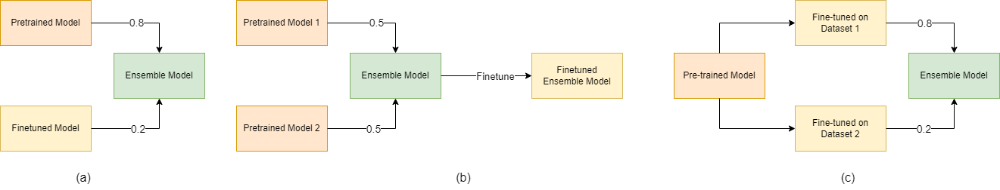

# LegalNER-CS60075
Repository for CS60075 Course Project 

Link to Project Report: https://drive.google.com/file/d/1uTS5oGIhPWyqAVL7R44m1E0sGo0WDDWW/view?usp=share_link <br>
Team Members:
|  Name | Roll Number |
| -------------------- | --------- |
| Sagnik Chakraborty   | 22CS60R08 |
| Tanishq Sharma       | 22CS60R27 |
| Tarun Mohanty        | 22CS60R28 |
| Vatsal Venkatkrishna | 19CH30037 |




# How to Run
## Formatting the Data
The `Legal_NER_DataFormatting.ipynb` notebook contains the code to the required data format. The source data formatting is of the format:
```{
        "id": <ID>,
        "annotations": [
            {
                "result": [
                    {
                        "value": {
                            "start": <start token 1>,
                            "end": <end token 1>,
                            "text": "<text 1>",
                            "labels": [
                                "<NER Label 1>"
                            ]
                        },
                    },
                    {
                        "value": {
                            "start": <start token 2>,
                            "end": <end token 2>,
                            "text": "<text 2>",
                            "labels": [
                                "<NER Label 2>"
                            ]
                        },
                        ...
                    },
  "data": {
            "text": "<Full Text>"
        },
        "meta": {
            "source": "<source>"
        }
 ```
The annotation is performed using the Spacy tokenizer. We hence extract the text and tokenize it using spacy, after which we use BIO-tag based formatting to extract the NER labels corresponding to each token in the text.
## Getting results
We use the `simpletransformers` Python module to obtain the results for our tasks. `Legal_NER_BERT.ipynb` contains the code for obtaining the baseline results using the models described in the report, While `Model_Fusing_Method_[1-3].ipynb` contains the result for the three model fusion methods. 
